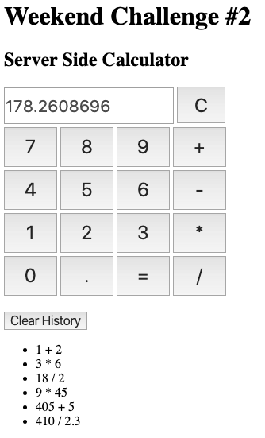

# Tier Week 8 Weekend Challenge: Server Side Calculator

[Here](./INSTRUCTIONS.md) is the instruction to the project instructions.

## Description

For this challenge, I created a calculator and all of the logic and/or calculations are implemented on the server.

It looks and acts like a regulator calculator. A user pressed the number keys for the first number, press an operator key and then press the number leys for the second number. The numbers and the operations are displayed in the calculator display filed in the order the keys were pressed. When the "=" button is pressed, the numbers selected and the operator selected are stored in an object and sent to the server. The server receives this information to calculate the result, store this result in an array and send this result to the front end. The front end receives the result and display the result on the page along with all of the previous calculations performed.

Just like a regular calculator, the previous answer can be used to continue the calculation. Press the "C" button to clear the calculator display and previous calculation data. When the "Clear History" button is pressed, a delete is sent to server to clear all history data.

On the server side I used node express and body-parser to POST (receive) and GET (send) data. On the front end, I used jQuery AJAX to POST (send) the data (values and operator selected) inputted by the user and GET (receive) the data (answer and historical operation data) and display them page.

## Screen Shot

Below is a screen shot of the application.

## Prerequisites

- [Node.js](https://nodejs.org/en/)

## Installation

You need to make sure you have node installed on your computer. then open up your terminal and run `npm install`.

## Built With

- javascript
- jQuery
- express
